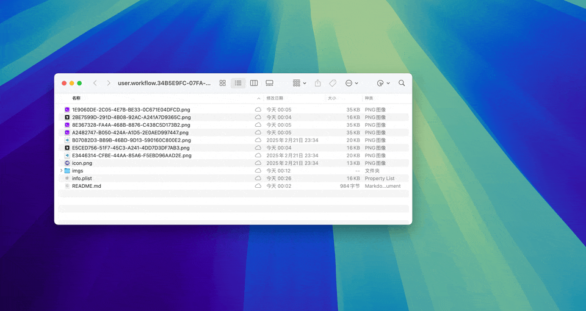
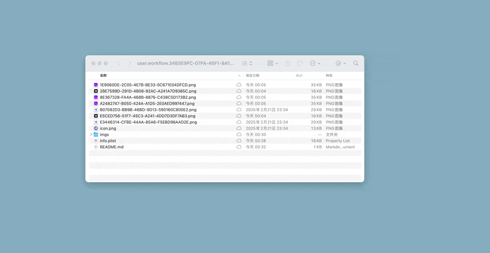

# alfred-iterm2-vscode-cursor

[中文](README_zh.md) | English

Open iTerm2, VS Code, or Cursor in the current Finder folder. 

## Features

- Open current Finder folder in `iTerm2`
- Open current Finder folder in `VS Code`
- Open current Finder folder in `Cursor`

## Supported Keywords

### Open Terminal (iTerm2)

The keyword to use this function:
- `终端` (Chinese: terminal)
- `iTerm`
- `open Terminal in current folder`

Example:

### Open VS Code

The keyword to use this function:
- `vscode`
- `Open vscode in current folder`

Example:

### Open Cursor

Open cursor is similar to open the vscode. The keyword to use this function:
- `cursor`
- `Open cursor in current folder`

## Usage

1. Make sure you have a Finder window open with the folder you want to work in
2. Open Alfred (default shortcut: Cmd+Space)
3. Type any of the supported keywords above
4. Press Enter to execute

The workflow will automatically detect the current Finder folder and open your chosen application in that location.