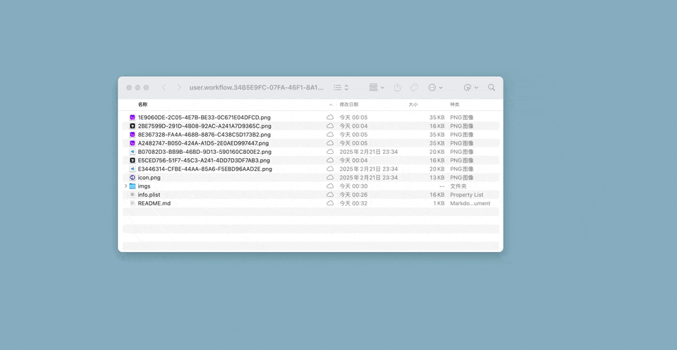

# alfred-iterm2-vscode-cursor

中文 | [English](README.md)

在当前 Finder 文件夹中打开 iTerm2、VS Code 或 Cursor。

## 功能

- 在 `iTerm2` 中打开当前 Finder 文件夹
- 在 `VS Code` 中打开当前 Finder 文件夹
- 在 `Cursor` 中打开当前 Finder 文件夹

## 支持的关键词

### 打开终端 (iTerm2)

使用此功能的关键词：
- `终端`
- `iTerm`
- `open Terminal in current folder`

示例：

### 打开 VS Code

使用此功能的关键词：
- `vscode`
- `Open vscode in current folder`

示例：

### 打开 Cursor

打开 Cursor 与打开 VS Code 类似。使用此功能的关键词：
- `cursor`
- `Open cursor in current folder`

## 使用方法

1. 确保您已打开一个 Finder 窗口，并导航到您想要工作的文件夹
2. 打开 Alfred（默认快捷键：Cmd+Space）
3. 输入上述任意一个支持的关键词
4. 按回车键执行

工作流将自动检测当前 Finder 文件夹，并在该位置打开您选择的应用程序。 